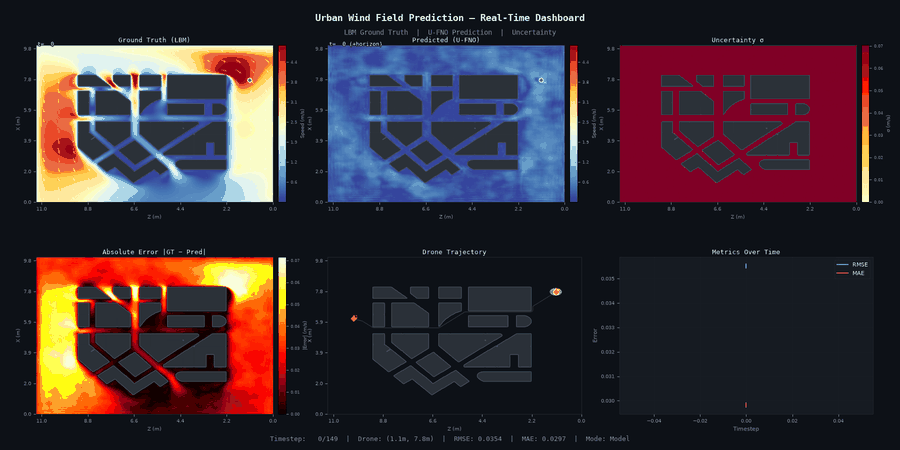

# Urban Wind Field Prediction via Drone Sampling

A machine learning pipeline that predicts urban wind fields from sparse drone
measurements. A drone flies through a city at a fixed altitude, sampling wind
velocity along its path; a neural network reconstructs and forecasts the full
2D wind field on that horizontal slice — data assimilation + short-horizon
forecasting, conditioned on known urban geometry.

| Phase | Goal | Status |
|-------|------|--------|
| Phase 1 — U-FNO | Single-snapshot reconstruction baseline | ✅ Complete |
| Phase 2 — Flow Matching | Probabilistic ensemble forecast + calibrated uncertainty | 🔄 In progress |
| Phase 3 — Trajectory Optimization | Risk-aware drone path planning from ensemble | ⏳ Planned |
| Phase 4 — Real CFD | Replace LBM solver with OpenFOAM | ⏳ Planned |

## Current Results (Phase 1 — U-FNO)



Held-out test set (16 unseen conditions, 512×512 grid, 128 training conditions):

| Vec RMSE | Speed MAE | Direction Error |
|----------|-----------|------------------|
| 2.75 m/s | 1.87 m/s  | 43.4°            |

Phase 2 (flow matching) is currently training; once complete, this section
will be updated with the ensemble forecast results and calibration metrics
(spread-error correlation, 90% interval coverage).

## Setup

Requires a conda environment (Python 3.11) and a CUDA-capable GPU for
reasonable training/inference speed (CPU fallback is automatic but slow at
512×512 resolution).

```bash
conda create -n urban-wind python=3.11 -y
conda activate urban-wind

# PyTorch with CUDA 12.8 (adjust the index URL for your CUDA version)
pip install torch --index-url https://download.pytorch.org/whl/cu128

pip install -r requirements.txt
```

Verify the GPU is visible:
```bash
python -c "import torch; print(torch.cuda.is_available(), torch.cuda.get_device_name(0))"
```

## Repository Structure

```
urban-wind-field-prediction/
├── scripts/
│   ├── generate_data.py    ← Step 1: run LBM for train + test conditions
│   ├── train_ufno.py       ← Step 2a: train U-FNO (Phase 1 baseline)
│   ├── train_fm.py         ← Step 2b: train FlowMatchingModel (Phase 2)
│   ├── infer_ufno.py       ← Step 3a: U-FNO inference
│   ├── infer_fm.py         ← Step 3b: flow-matching ensemble inference
│   ├── evaluate_ufno.py    ← Step 4: benchmark U-FNO on held-out conditions
│   └── run_pipeline.py     ← Legacy: single-condition end-to-end convenience script
│
├── src/
│   ├── data/
│   │   ├── lbm_solver.py     ← 2D LBM wind field simulator (D2Q9, GPU-native)
│   │   ├── geometry.py       ← STL → obstacle mask + SDF (build_geo_channels)
│   │   └── drone_sampler.py  ← A* traverse path + vectorized obs_to_grid
│   ├── models/
│   │   ├── ufno.py           ← U-FNO network (~7.4M params), heteroscedastic
│   │   └── flow_matching.py  ← Spatiotemporal U-Net + DPS + Leray + physics prior
│   ├── training/
│   │   ├── train_ufno.py     ← NLL + divergence loss training loop
│   │   └── train_fm.py       ← Flow-matching training loop
│   ├── evaluation/
│   │   └── calibration.py    ← Ensemble spread-skill correlation, interval coverage
│   └── viz/
│       └── visualize.py      ← 6-panel interactive dashboard
│
├── data/                    ← STL model + cached LBM data (gitignored)
├── outputs/                 ← Checkpoints + visualizations (gitignored)
└── docs/
    ├── project_overview.md  ← Start here for project context
    ├── ARCHITECTURE.md      ← Full model + pipeline architecture
    ├── ROADMAP.md           ← Open questions, planned work
    └── DECISIONS.md         ← Rationale behind key design choices
```

## Quick Start

### 1. Generate training data
```bash
python scripts/generate_data.py --stl data/city_model.STL --grid 512 --steps 500 --warmup 2000
```

### 2a. Phase 1 — train and run U-FNO
```bash
python scripts/train_ufno.py --epochs 200
python scripts/infer_ufno.py --stl data/city_model.STL --model outputs/ufno/wind_fno.pth
python scripts/evaluate_ufno.py --stl data/city_model.STL --test-data data/lbm_test.npz \
  --model outputs/ufno/wind_fno.pth
```

### 2b. Phase 2 — train and run flow matching
```bash
python scripts/train_fm.py --epochs 200 --batch 4 --T-out 10 --hidden 32 --n-levels 4
python scripts/infer_fm.py --stl data/city_model.STL --angle 45 --speed 0.08 --n-samples 20
```

## Key Parameters

| Script        | Argument      | Default | Notes                                     |
|---------------|---------------|---------|--------------------------------------------|
| `train_ufno.py` | `--epochs`  | 200     | Total epochs                              |
| `train_fm.py`   | `--epochs`  | 200     | Total epochs                              |
| `train_fm.py`   | `--batch`   | 4       | Recommended for 512×512 (~24 GB VRAM)     |
| `train_fm.py`   | `--T-out`   | 10      | Forecast sequence length at 512²          |
| `train_fm.py`   | `--hidden`  | 32      | U-Net base channels at 512²               |
| `infer_fm.py`   | `--n-samples` | 20    | Ensemble size                             |
| `infer_fm.py`   | `--n-steps`   | 20    | ODE integration steps (DPS-guided)        |

See `docs/ARCHITECTURE.md` for the full model design and `docs/project_overview.md`
for the complete parameter reference.

## Architecture at a Glance

**Phase 1 — U-FNO**: geometry mask + sparse drone observations + coordinate
grids → Fourier Neural Operator → dense wind field + per-cell uncertainty,
single-snapshot prediction.

**Phase 2 — Flow Matching**: geometry (mask + SDF) and drone observations
condition a spatiotemporal U-Net trained with rectified flow matching. A
physics-informed prior (Leray-projected, confidence-weighted ambient field)
replaces pure Gaussian noise as the sampling source. Inference uses DPS-guided
ODE integration to produce an N=20 ensemble forecast, with calibration metrics
(spread-error correlation, interval coverage) reported on every run.

## Hardware

Developed and benchmarked on an NVIDIA RTX 5000 Ada (32GB VRAM), CUDA 12.8.
Falls back to CPU automatically if CUDA is unavailable (`--device cpu`).
